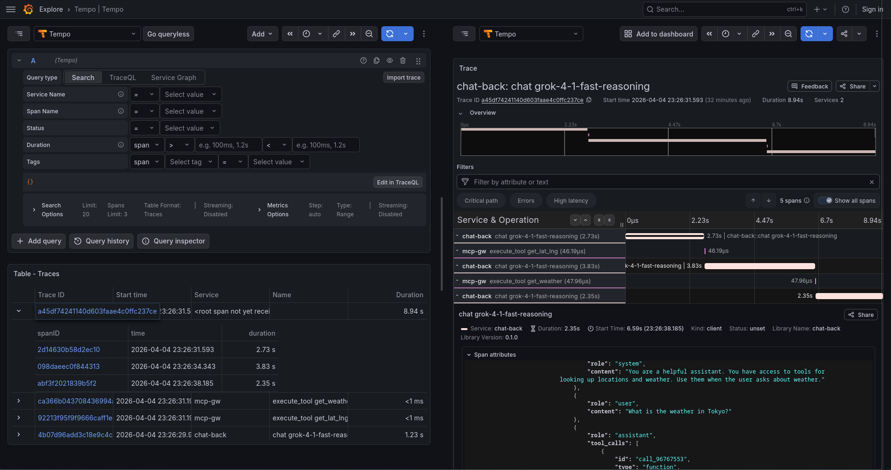

# GenAI LLM+MCP Decen Arch Demo 001 V2

A Kubernetes-native AI gateway lab that routes LLM inference and MCP tool
calls through **Envoy AI Gateway**, backed by **Azure AI Foundry** and a
local **FastMCP** tool server — all running on a local KIND cluster.

Two client implementations demonstrate the full inference + tool-call loop:
- **chat-front1-py** — headless Pydantic AI agent (runs once on pod start, logs to stdout)
- **chat-front2-ui** — browser chat UI (ChatGPT-style, served at `http://localhost:30200`)

## Architecture

```
               ┌────────────────────────────────────────────────────────┐
               │              KIND cluster (ai-gw-lab)                  │
               │                                                        │
               │  ┌──────────────────────────────────────────────────┐  │
               │  │        oauth-idp  :30300  (mock IDP)             │  │
               │  │        issues JWT Bearer tokens for clients      │  │
               │  └────────────────┬──────────────────┬──────────────┘  │
               │               JWT ▼              JWT ▼                 │
 browser       │   ┌─────────────────┐   ┌───────────────────────────┐  │
 :30200 ───────│─▶│ chat-front2-ui  │   │      chat-front1-py       │  │
               │   │ browser proxy   │   │      Pydantic AI agent    │  │
               │   └────────┬────────┘   └─────────────┬─────────────┘  │
               │            │ Bearer JWT               │ Bearer JWT     │
 curl  :30080  │    ┌───────▼──────────────────────────▼──────┐         │
───────────────│──▶│           Envoy AI Gateway              │         │
               │    │      Gateway + Routes + JWT auth        │         │
               │    └──┬────────────────────────────┬─────────┘         │
               │       │ /v1/chat/completions       │ /mcp              │
               │       ▼                            ▼                   │
               │  ┌──────────────┐        ┌─────────────────┐           │
               │  │  Azure AI    │        │ mcp-server      │ FastMCP   │
               │  │  Foundry     │        │ - get_lat_lng   │           │
               │  │  (gpt-5.1)   │        │ - get_weather   │           │
               │  └──────────────┘        └─────────────────┘           │
               └────────────────────────────────────────────────────────┘
```

**Envoy replaces chat-back** — there is no separate inference proxy.
Envoy AI Gateway routes `/v1/chat/completions` to Azure AI Foundry and
`/mcp` to mcp-server based on `AIGatewayRoute` and `MCPRoute` CRDs.

## Services

| Component | Port | Description |
|-----------|------|-------------|
| [Envoy AI Gateway](docs/SETUP.md) | 30080 | Routes inference + MCP, JWT enforcement, deployed via Helm |
| [mcp-server](mcp-server/) | 8200 (in-cluster) | FastMCP tool server (`get_lat_lng`, `get_weather`) |
| [chat-front2-ui](chat-front2-ui/) | 30200 | Browser chat UI — ChatGPT-style, full inference + tool-call loop |
| [chat-front1-py](chat-front1-py/) | — | Headless Pydantic AI agent — runs one loop on start, logs to stdout |
| [oauth-idp](oauth-idp/) | 30300 | Mock OAuth2 IDP — mints JWTs for testing (not for production) |

## Logging



## Quick Start

### Prerequisites

- Podman 5.x, KIND 0.31+, Helm 3.17+, kubectl 1.35+
- Azure CLI + an Azure AI Foundry resource (see [docs/AZ_CLI.md](docs/AZ_CLI.md))

### 1. Create the cluster and deploy

```bash
# One-time: fill in your Azure API key
cp k8s/secrets/azure-ai-foundry-apikey.yaml.example \
   k8s/secrets/azure-ai-foundry-apikey.yaml
# edit the file

make restart   # tear down any existing cluster and build fresh
make test      # verify 8/8 integration tests pass
```

See [docs/SETUP.md](docs/SETUP.md) for a full explanation of each step.

### 2. Use the browser UI

Open **http://localhost:30200** — a ChatGPT-style interface that routes
inference and tool calls through Envoy AI Gateway. Check the
**Enable MCP tools** box to see the full RAG loop (LLM calls
`get_lat_lng` → `get_weather` → final answer).

### 3. Verify via curl

```bash
# Envoy ready?
kubectl get gateway ai-gw-lab

# All pods running?
kubectl get pods -A

# Check chat-front1-py logs for the one-shot agent run
kubectl logs -l app=chat-front1-py
```

## curl Examples

> These hit Envoy directly at `:30080`. All requests require a Bearer
> token — get one with:
> ```bash
> TOKEN=$(curl -s -X POST http://localhost:30300/admin/token \
>   -H "Content-Type: application/json" \
>   -d '{"sub":"test"}' | python3 -c "import sys,json;print(json.load(sys.stdin)['access_token'])")
> ```
> Or just use the browser UI at **http://localhost:30200** — it handles auth automatically.

### Inference (Azure AI Foundry via Envoy)

```bash
curl -s http://localhost:30080/v1/chat/completions \
  -H 'Content-Type: application/json' \
  -H 'x-ai-eg-model: gpt-5.1' \
  -d '{
  "model": "gpt-5.1",
  "messages": [
    {"role": "system", "content": "Respond in one short sentence."},
    {"role": "user", "content": "What is 2+2?"}
  ],
  "max_tokens": 50
}'
```

### MCP Tool Call (mcp-server via Envoy)

```bash
# 1. Initialize MCP session
curl -s http://localhost:30080/mcp \
  -H 'Content-Type: application/json' \
  -H 'Accept: application/json, text/event-stream' \
  -d '{
  "jsonrpc": "2.0", "id": 1, "method": "initialize",
  "params": {
    "protocolVersion": "2024-11-05",
    "capabilities": {},
    "clientInfo": {"name": "curl", "version": "0.1"}
  }
}'
# Note the Mcp-Session-Id response header

# 2. List tools
curl -s http://localhost:30080/mcp \
  -H 'Content-Type: application/json' \
  -H 'Accept: application/json, text/event-stream' \
  -H 'Mcp-Session-Id: <session-id>' \
  -d '{"jsonrpc": "2.0", "id": 2, "method": "tools/list", "params": {}}'

# 3. Call a tool
curl -s http://localhost:30080/mcp \
  -H 'Content-Type: application/json' \
  -H 'Accept: application/json, text/event-stream' \
  -H 'Mcp-Session-Id: <session-id>' \
  -d '{
  "jsonrpc": "2.0", "id": 3, "method": "tools/call",
  "params": {
    "name": "get_lat_lng",
    "arguments": {"location_description": "London, UK"}
  }
}'
```

## Integration Tests

The test suite targets Envoy at `localhost:30080` (the cluster must be
running):

```bash
python3 tests/test_integration.py
```

See [docs/TEST.md](docs/TEST.md) for details.

## Unit Tests

Each service has its own pytest suite:

```bash
cd mcp-server   && uv run pytest tests/ -v
cd chat-front1-py && uv run pytest tests/ -v
```

## Docs

| Document | Description |
|----------|-------------|
| [SETUP.md](docs/SETUP.md) | Full step-by-step deployment guide |
| [CLUSTER.md](docs/CLUSTER.md) | KIND cluster details |
| [AZ_CLI.md](docs/AZ_CLI.md) | Azure CLI setup & teardown |
| [MCP.md](docs/MCP.md) | MCP gateway and MCPRoute configuration |
| [TEST.md](docs/TEST.md) | Testing guide |
| [PROMPT.md](docs/PROMPT.md) | Original project prompt |

## Tech Stack

- **Kubernetes** (KIND) + **Envoy AI Gateway** for inference routing and MCP proxying
- **Azure AI Foundry** (gpt-5.1) as the upstream LLM provider
- **Python 3.12** + **uv** for package management
- **Pydantic AI** (chat-front1-py) with `MCPServerStreamableHTTP` for native MCP tool discovery
- **FastAPI + vanilla JS** (chat-front2-ui) for the browser chat UI with server-side Envoy proxy
- **FastMCP** (mcp-server) for MCP Streamable HTTP tool serving
- **Podman** (rootless) for container builds
